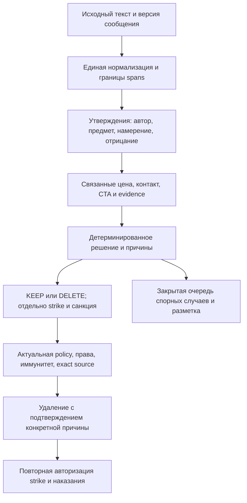

# Коммерческий фильтр: актуальный аудит и план развития

Дата: 1 октября 2026, Москва. Базовый HEAD: `727c8332f8b7fa721b5427d594741b3034ca1cdb`.
Первоначальный аудит ниже зафиксирован до реализации: анализ исходников, локальные
тесты и синтетические воспроизведения. Дефекты CF-01–CF-16 описывают исходную версию.
Реализация выполнена в отдельном рабочем дереве поверх `166415f2`, сохранив параллельные
изменения проекта. Актуальные действия и результаты приведены перед историческим аудитом.

## Реализация по итогам аудита

- CF-01–CF-06: защищены покупательские запросы, переставленные отрицания и жалобы;
  самостоятельные платные предложения после отказа распознаются отдельно.
  Сохранён регистр при нормализации похожих букв; цена с переносом и локальные
  телефоны обрабатываются общими детектором и обезличиванием. Добавлены парные примеры.
- CF-07–CF-08: проверки качества учитывают фактическое разрешение удаления,
  включая WARN, и требуют явную KEEP/DELETE-разметку. Добавлены проверяемые
  происхождение, временное разделение, группировка и двойная независимая оценка.
  Исторические автоматические метки не переписываются.
- CF-09–CF-10: одна квота иммунитета на логическое сообщение и день; отозванное
  право не восстанавливается старой квитанцией. REVIEW/KEEP не расходуют квоту.
- CF-11: текущее разрешение проверяется перед удалением, учётом нарушения,
  уведомлением и наказанием. Короткое разрешение привязано к конкретному доказательству;
  несовместимые версии правил не могут разделять право на действие.
- CF-12–CF-15: сохранение по разделам и версиям, честное отображение особых настроек,
  общие пороги без скрытого зазора, фактическое третье наказание и независимые
  коммерческие/анти-мат шаблоны. Проверены мобильные экраны в обеих темах.
- CF-16: время события отделено от неизменного времени создания фото; повторы и
  задержка обработки не продлевают срок удаления. Строгая проверка фото работает
  в активном основном режиме с явным BASELINE-разрешением и живой проверкой native OCR.
  Будущее расширение CERTIFIED сохраняет независимые проверки; фиктивных сертификатов нет.

Дополнительно: ограниченный LRU на 512 решений, отдельные скользящие окна кампаний,
общий аварийный выключатель текстовых действий и закрытая очередь проверки качества
с отдельной таблицей, сроком хранения 14 дней и отсутствием влияния на репутацию.
Миграции добавляют поля независимых шаблонов с сохранением старых текстов и новую
пустую таблицу; существующие поля не удаляются, Postgres/Redis не пересоздаются.

Проверка реального текста: bounded read-only аудит production за 30 сентября,
21:00–23:00 UTC, обработал 1 638 записей и оценил 1 229 сообщений после исключения
администраторов/ботов. Исходная production-версия дала 18 разрешений очистки
(15 WARN и 3 DELETE), 13 REVIEW_ONLY. У 13 сообщений обезличивание меняло решение.
Это автоматическая диагностика исходной версии, не независимая оценка точности.
Проверка не отправляла сообщения и не удаляла контент.

Реальная проверка фото использовала текущий production sandbox и новые локальные
правила в проверенном инструменте без модулей отправок/удалений. Из ограниченных
500 записей выбраны три уникальные полные фотографии из чатов с включённым фильтром.
Все три загрузились и распознались в обоих проходах; строгая политика сохранила
все три. Живая native identity совпала с ожидаемой. Среднее время шести распознаваний
3 547 мс, максимум 6 908 мс. Ни подписи, ни OCR-текст, ни URL, ни идентификаторы
в отчёт не выводились. Три снимка доказывают реальную работу распознавания, но
не устанавливают статистическую точность удаления рекламы.

Миграции успешно применены на отдельном PostgreSQL 16; публичная проверка гонок
дала 24 suites / 175 tests passed. Настоящие Redis-проверки подтвердили паритет
Lua и локального трекера на границах окон, поздних событиях и заполнении лимита.

На локальном синтетическом CPU-тесте кеш полного решения сократил среднее время
повторного входа с 2,8847 до 0,00856 мс при совпадении 1 320 решений. На уникальных
входах среднее 3,1732/3,1442 мс без заметного удорожания. Эти числа не измеряют
production задержку, дополнительные Redis-запросы или MAX.

Работающий фильтр не зависит от обучаемой модели. Её внедрение имеет смысл только
после отдельно доказанного улучшения на независимой выборке; такой выборки сейчас
нет, и результаты тестов не подменяют её. Правила имеют регрессионное покрытие и
проверки исполнения; популяционные precision/recall не заявляются.

## Исторический вывод первоначального аудита

Фильтр имеет развитую защиту самого удаления, но распознавание намерения автора,
учёт иммунитета, последующие санкции, настройки и проверка качества пока расходятся.
Текущий приоритет — закрыть эти разрывы и доказать качество на независимой выборке.
Глобальное снижение порогов и ускоренное включение коммерческого OCR не обоснованы.

Уже реализованы общий phone parser, полный ключ bounded LRU-кеша, явный
`messageDisposition`, assertion context для ряда запросов/отзывов, привязка удаления
к версии сообщения и повторная проверка перед DELETE. Эти исправления сентября
не объявляются заново отсутствующими. Их нужно сохранить при дальнейшем развитии.

Зелёные тесты не устанавливают качество на реальном потоке: обнаруженные ниже
контрпримеры проходят мимо существующего покрытия. Ошибочные решения здесь означают
локально воспроизведённое право удаления, а не подтверждённое удаление реального сообщения.

## Объём и достоверность проверки

Проверены текстовый detector/scorer/policy, normalization, phone/corpus tools,
campaign tracker, handler/immunity/sanction execution, delete guard, OCR admission,
exact source identity и policy, contracts, settings API, mini app и Safety Desk.
Проверка OCR является аудитом кода и синтетических входов, не испытанием реального
распознавания фотографий на native sandbox.

- Node `24.16.0`; ранний `node scripts/agent/preflight.mjs` прошёл все четыре проверки.
- `npm test --workspace @maxim/api -- commercial`: **87 suites, 2 593 tests passed**,
  один snapshot прошёл; одна suite / 10 Redis integration tests пропущены.
  Для них требуется локальный `MAXIM_TEST_REDIS_URL`.
- В этот запуск вошёл штатный commercial benchmark с локальными ограничениями:
  hot-path p95 ≤ 6,25 мс, p99 ≤ 15 мс; adversarial p95 ≤ 75 мс, p99 ≤ 100 мс.
  Это локальный тест, не измерение production latency, Redis/MAX round trips или OCR.
- Контрпримеры выполнялись текущими функциями через Node + TSX, без новых runtime-файлов.
  Текстовые примеры ниже используют вымышленные контакты. Если не указано иначе,
  профиль — BALANCED 45/65; ключевые intent-ошибки повторены в STRICT 38/55.
- Checked-in text corpus содержит 18 324 строки / 9 013 уникальных текстов.
  Все 18 324 метки — `commercial-audit-policy-v1`, то есть автоматические.
  В этой fixture нет event fingerprint и ключей группировки автора/кампании/сообщения.
  Существующий отдельный исторический manual overlay не является новым temporal holdout.
- В рабочем дереве до начала были чужие изменения; во время работы появились
  дополнительные параллельные изменения. Они сохранены. Проверки относятся к
  локальному дереву, а не к зелёному exact-SHA CI или проверенному production image.

Ниже отдельно перечислены воспроизводимые дефекты и осознанные ограничения.
Полный список ошибок на всём реальном потоке без независимой разметки установить нельзя.

## Подтверждённые дефекты

### CF-01 · P1 · Запрос покупателя услуги принимается за рекламу

`Я хочу заказать уборку квартиры. Оплачу 3000 рублей, звоните 8 900 000 10 42.`
получает `DELETE / messageDisposition=DELETE`, `fpRisk=policyFpRisk=0`.
Воспроизводятся также формы «Закажу уборку», «Буду заказывать», «Куплю услуги электрика».

`commercial-service-speech-act.ts:6` покрывает преимущественно «ищу/нужен/кто/есть».
При нераспознанной роли последующие цена, услуга и телефон образуют оффер.
Нужна роль покупателя и привязка бюджета/контакта к запросу, а не новый общий allowlist.

### CF-02 · P1 · Перестановка отрицания меняет безопасность

`Услуги сантехника я не оказываю. Телефон 8 900 000 10 42.` → `WARN / DELETE`.
`Ремонт холодильников не выполняю. Телефон …` → `WARN / DELETE`.
Контрпара `Я не оказываю услуги сантехника. Телефон …` → нет срабатывания.

Причина: `commercial-service-speech-act.ts:14` распознаёт ограниченный порядок слов
и набор глаголов. `WARN` действительно разрешает cleanup в
`commercial-action-policy.ts:45`; это не защита от удаления.

### CF-03 · P1 · Жалоба на исполнителя становится собственным оффером

`Мастер обманул меня. Ремонт холодильников 2000 рублей, телефон 8 900 000 10 42.
Никому не советую.` → `DELETE / DELETE`, оба FP-risk равны нулю.
Аналогично срабатывает «Этот мастер мошенник… Его телефон…».

Speech-act модель не имеет самостоятельного `COMPLAINT`; local context может
принять следующий каталог ремонта с ценой/телефоном за независимый оффер
(`commercial-local-context.ts:870`). Нужна связь утверждений с третьим лицом,
историческим обещанием и отрицательной оценкой.

### CF-04 · P1 · Ранняя потеря регистра позволяет обходить нормализацию

`BЫКУП АBТОМОБИЛЕЙ в любом состоянии, расчёт на месте, звоните 8 900 000 10 42.`
не срабатывает; кириллическая контрпара получает `DELETE`.
`Билет в лотерею 200 рублей. ЛОТ С ПОBТОРОМ, оплата на карту 8 900 000 10 42.`
аналогично теряет high-risk срабатывание относительно контрпары с `ПОВТОРОМ`.

`rule-engine-detection-context.ts:24` выполняет lowercase до mapping `B → в`
в `commercial-normalization.ts:39`. После этого латинская `b` превращается в `б`.
Похожий ранний lowercase есть в `commercial-features.ts:240`.
Исправлять нужно общий входной путь; проверка только normalization helper этот дефект не ловит.

### CF-05 · P2 · Защищённая часть скрывает самостоятельное предложение

`Я не занимаюсь ремонтом холодильников, но делаю натяжные потолки от 300 рублей
за метр. Звоните 8 900 000 10 42.` → нет срабатывания в обоих профилях.
`Ищу электрика, но предлагаю ремонт холодильников от 2000 рублей. Звоните …`
тоже пропускается.

`commercial-service-speech-act.ts:33` разделяет контраст для ограниченного списка
глаголов, пропуская «делаю/предлагаю» и альтернативу «только».
Нужно отдельно классифицировать предмет и полярность каждой части предложения.

### CF-06 · P1 для данных / P2 для классификации · Телефон поглощает соседнюю цену

Для строки `Телефон +7 900 000 10 42`, затем новой строки `500 руб`, parser возвращает
`79000001042500`. Маскирование выдаёт `Телефон [phone] руб` и уничтожает цену.
Международный greedy pattern в `commercial-phone.ts:16` допускает newline и
исполняется раньше более точного российского pattern (`:103`).

Отдельный механизм: у строки `Телефон 8 900 000 10 42`, затем новой строки `500 руб`, phone parser корректен,
но итоговый sanitizer выдаёт `Телефон [card] руб`. Финансовый regex склеивает
номер и цену; объединение случайно проходит Luhn, а redaction выполняется до phone
(`commercial-corpus-sanitization.util.ts:61,81`).

`Телефон 9000001042 / 9000001043` остаётся без маскирования; независимый residual
checker также возвращает `false`. Его телефонная ветка проверяет только начало 7/8
(`:93`). Это воспроизведённый пропуск проверки приватности на синтетическом входе;
факт публикации реальных контактов в этой работе не устанавливался.

### CF-07 · P1 · Gate качества не учитывает право удаления

`validate-commercial-corpus.ts:188` сохраняет из snapshot только hit/actionBand/subtype.
Изменение `messageDisposition=DELETE → KEEP` с тем же `WARN` не считается drift
(`:329`); `--require-sanitization-parity` на синтетической записи проходит с drift=0.

`--quality-gate` на трёх вручную помеченных синтетических строках, с min counts=1,
принимает positive с ожидаемым `WARN`, но фактическим `WARN/KEEP`: errors=[].
Размер здесь намеренно уменьшен для unit-воспроизведения. Проблема не в размере,
а в том, что gate не сравнивает ожидаемое и реальное действие над сообщением.

`commercial-detector-harness.util.ts:358` считает unexpected deletes только по
`DELETE/DELETE_AND_ESCALATE`. Negative observation с `WARN` даёт
`falsePositiveHits=1`, но `unexpectedDeletes=0`. Поля disposition/actionable
в типе quality observation нет, хотя runtime допускает cleanup для WARN.

### CF-08 · P2 · «Gold» тест допускает именно то удаление, которое обещает исключить

Тест `commercial-gold.spec.ts:107` называется «reviewable instead of deleting»,
но допускает `WARN` и проверяет только отсутствие bands `DELETE/DELETE_AND_ESCALATE`.
Его пример с комплектом ПК, доставкой, ценой и телефоном получает `WARN/DELETE`.

Это доказанный дефект тестового утверждения. Сама граница «разовая продажа без
явного признака б/у» требует продуктового решения: название теста не заменяет policy.
Все отрицательные safety-тесты должны проверять фактическую cleanup eligibility.

### CF-09 · P1 · REVIEW_ONLY и повторы могут расходовать иммунитет

`moderation.service.legacy.ts:2403` расходует квоту до выбора top violation
и определения actionable/recordable (`:2423`). Поэтому одиночный коммерческий
`REVIEW_ONLY` расходует `dailyViolationUsage`, хотя сообщение сохраняется.
Инкремент — `participant-moderation-immunity.service.ts:45`.

Legacy consumer не принимает messageId: edits одного иммунного объявления могут
повторно расходовать квоту. Идемпотентный `consumeForMessage` уже существует (`:97`),
но ранний handler его не использует. Это вывод из текущего порядка вызовов и SQL;
production частота и гонки с реальной БД не измерялись.

### CF-10 · P1 · Guard удаления не отзывает последующее наказание

Перед DELETE есть актуальные проверки. Но затем санкция вычисляется по старому
`settings` (`moderation.service.legacy.ts:2671,2770`) и передаётся в
`applySanctionAction` (`:3139`). `beforeSanctionMutation` в этой ветке — guard
stop words; для `COMMERCIAL_AD` он отсутствует
(`stop-words/stop-words.execution.ts:18`).

У `applySanctionAction` есть lock/fence и защита runtime-ботов, но этот call site
не передаёт commercial authorization (`:4774,4797,4913`). Выключение фильтра,
mute/ban после DELETE и до follow-up не переавторизует коммерческое наказание.
Это подтверждённый разрыв в коде; live race с реальным пользователем не запускался.

### CF-11 · P1/P2 · Старый экран может вернуть старые настройки фильтра

`settings-page.legacy.tsx:4988` строит полный snapshot из `settingsQuery.data`
и изменённой секции. `chat-settings-client.ts:216` отправляет его целиком.
Сервер читает revision уже при поступлении запроса (`admin-chat-settings.ts:822`)
и сравнивает только этот revision при записи (`:1031`).

Если A сохранил новый профиль, затем B со старого экрана сохранил другую секцию,
старый commercial profile из snapshot B может перезаписать изменение A.
Серверный CAS защищает гонку внутри запроса, но не устаревший клиентский read.

### CF-12 · P2 · Сохранённые пороги отличаются от исполненных

Контракт требует только Delete>Warn (`packages/contracts/src/core.ts:1108`).
Runtime требует Delete≥Warn+5 (`rule-engine-commercial-thresholds.ts:26`).
Валидный профиль 45/46 фактически исполняется как 45/50.
Нужна единая canonical validation/normalization и возврат эффективного профиля.

### CF-13 · P2 · Ползунок скрывает и может перезаписать нестандартный профиль

`settings-page-helpers.tsx:1163` восстанавливает позицию только по sensitivity/warn,
игнорируя deleteThreshold. Воспроизведение текущих helpers:

| Сохранено       | Что показывает ползунок | Что даёт повторный выбор этой позиции |
| --------------- | ----------------------- | ------------------------------------- |
| BALANCED 45/100 | 69, «Баланс»            | BALANCED 45/65                        |
| BALANCED 10/20  | 69, «Баланс»            | BALANCED 45/65                        |
| STRICT 90/91    | 70, «Строго»            | STRICT 44/63                          |

Нужны канонические presets и честное состояние `CUSTOM`, без неявной потери данных.

### CF-14 · P2 · UI обещает блокировку на четвёртом шаге, runtime может банить на третьем

UI показывает «3. Ограничение» и «4. Блокировка»
(`settings-commercial-filter-section.tsx:398,410`), допускает Ban=true/Mute=false.
При такой комбинации count=3 сразу даёт BAN (`moderation.service.legacy.ts:5584`).
Показывать нужно реальную лестницу из общего resolver для всех комбинаций toggles.

### CF-15 · P2 · Коммерческий шаблон сообщения используется и для мата

Редактор коммерческого фильтра меняет `textFiltersBotMessageText` и
`textFiltersWarnMessageText`; profanity использует эти же поля
(`moderation.service.legacy.ts:5699`). Текст «реклама запрещена» может уйти за мат.
Нужны отдельные templates либо явное наследование, видимое в обеих настройках.

### CF-16 · P2 · OCR сравнивает время события с временем создания сообщения

Parser кладёт Update.timestamp в нормализованный message.createdAt
(`webhook.parser.ts:72`). Это правильно для порядка событий/редактирований,
но OCR candidate переносит его в sourceCreatedAt
(`commercial-ocr-enqueue-candidate.ts:52`, handler `:1654`).

Exact photo extractor получает Message.timestamp, а `sameAlbumSource`
требует полного равенства с job time (`commercial-ocr-moderation.service.ts:1287`).
Синтетический Update.timestamp на 150 мс позже Message.timestamp уже не совпадает.
Такой вход может быть отвергнут до анализа, включая shadow.
Нужно разделить event time/deadline и immutable message creation identity,
сохранив строгую проверку источника. Допуск «±несколько секунд» не является исправлением.

## Осознанные ограничения и улучшения

1. **Независимая оценка текста отсутствует в текущей fixture.** Auto labels,
   исторический regression overlay и разработческие paired examples не дают
   population precision/recall. Эвристические `commercialProbability` и `fpRisk`
   не калиброваны; ошибочные удаления выше имеют risk=0.
2. **REVIEW_ONLY не имеет коммерческой очереди рассмотрения.** Safety Desk принимает
   только `VK_REVIEW` (`packages/contracts/src/safety-desk.ts:11`). Нужны закрытый
   workflow кандидатов/обжалований, ручные labels и исход рассмотрения.
3. **Нет общего rollout/kill switch для новой текстовой policy.** Per-chat toggle
   повторно проверяется при DELETE, но не заменяет shared execution-time control.
   Эта граница уже описана в commercial text delete runbook.
4. **Campaign окна привязаны к первому событию.** `SADD + EXPIRE` сбрасывает весь
   set (`redis-counter.service.ts:240`); модель явно закреплена тестом
   `commercial-campaign.util.spec.ts:72`. Это не новая regression, но «5m velocity»
   не является точным скользящим окном: активность у границы может исчезнуть.
5. **«Sanitized» не означает полное обезличивание.** Имена и домашние адреса не
   удаляются текущим sanitizer. Синтетическая строка с ФИО/улицей/квартирой проходит
   residual check. Такие тексты нельзя автоматически признавать пригодными для
   публичных fixtures; нужны отдельная проверка и закрытая политика хранения.
6. **OCR намеренно консервативен.** Только message_created, не edits;
   whole-caption/any-image safe-context veto; проверки кириллицы; исключение
   WARN и многих GOODS/GENERIC решений. Безопасная подпись может прикрыть
   самостоятельную рекламу на фото. Это существующая policy, а не основание
   глобально отключать veto. Расширять нужно по отдельным размеченным cohorts.
7. **Статус покрытия фото скрыт.** Несертифицированный settings profile переводит
   коммерческий OCR в shadow (`commercial-ocr-runtime-policy.service.ts:404`).
   Ползунок даёт 37 разных профилей, certification cap — 32. До promotion нужно
   согласовать набор presets/сертификатов и показать effective text/photo coverage.
8. **Разрешённая ссылка не является разрешением рекламы.** Domain allowlist не
   передаётся коммерческому текстовому detector. Это допустимая граница, которую
   нужно объяснить. Для рекламы «по согласованию» полезен узкий отзывной permit
   для конкретного post/content hash; общий иммунитет слишком широк.

## Целевая модель решения

Расширять существующие focused модули; не создавать параллельный detector или
второй независимый список suppressors. Общие pure helpers должны использоваться
runtime, guards, replay, quality gates и UI preview.

Рекомендуемое расширение evidence: assertion span и completeness; actor
`AUTHOR | BUYER | THIRD_PARTY | UNKNOWN`; role
`OFFER | REQUEST | TESTIMONIAL | COMPLAINT | REFUSAL | DISCUSSION | UNCERTAIN`;
subject, polarity, response target, собственник контакта/бюджета/CTA,
supporting anchors, settings/policy/source identity.
При потерянном или усечённом контексте нельзя сертифицировать безопасный смысл
или автоматически усиливать санкцию. Отдельный собственный оффер не наследует
защиту соседнего запроса, жалобы или цитаты.

`messageDisposition`, право записать strike и санкция участнику должны иметь
раздельные typed значения. `actionBand` сохраняется для совместимости;
`WARN` нельзя трактовать как KEEP, а `DELETE_AND_ESCALATE` — как уже применённый бан.
Фактическое удаление/наказание отделяются от классификации и попытки исполнения.

## Оптимизированный порядок реализации

Оценки — рабочие дни одного разработчика с ревью; уточнить после проектирования.
Сбор holdout идёт параллельно. Каждая строка — самостоятельный reviewable PR.

| Этап | Результат                                                                               | Зависимость                                                       |                Оценка |
| ---- | --------------------------------------------------------------------------------------- | ----------------------------------------------------------------- | --------------------: |
| 1    | Единая cleanup policy в benchmark/gold/corpus; expected disposition; новые контрпримеры | Нет                                                               |                   2–3 |
| 2A   | Message-scoped immunity только для enforceable нарушений                                | Этап 1                                                            |                   2–3 |
| 2B   | Commercial guard непосредственно перед strike/mute/ban                                  | Этап 1                                                            |                   3–4 |
| 2C   | Client revision + PATCH секций; canonical thresholds/presets                            | Этап 1; можно параллельно 2A/2B                                   |                   3–5 |
| 3    | Исправление normalization, phone/card spans и privacy validation                        | Этап 1                                                            |                   3–4 |
| 4    | Расширение assertion actor/role/polarity; CF-01–05                                      | Этап 3, frozen paired set; этап 5 до активации нового KEEP→DELETE |                   4–6 |
| 5    | Shared text shadow/canary/kill switch, метрики и feedback                               | Модель disposition из этапа 1                                     |                   3–5 |
| 6    | Honest UI: outcomes, лестница, CUSTOM, отдельные templates/coverage                     | Этап 2C; runtime resolver                                         |                   2–4 |
| 7    | OCR clock identity fix; отдельная повторная сертификация                                | Этап 1; независимый foundation PR, можно параллельно 2–6          |  2–3 + оценка корпуса |
| 8    | Campaign sliding windows и точечная оптимизация по профилю                              | Этапы 4–5, независимая оценка                                     |                   3–5 |
| 9    | Локальная обучаемая вторая стадия, если данные докажут пользу                           | Holdout, feedback, rollout                                        | Отдельный эксперимент |

### Этап 1: сначала сделать проверку способной ловить ошибку

- В corpus schema добавить expected disposition и поля actionable/recordable.
  Сравнивать disposition, hit, anchors/ownership, subtype и policy reason codes;
  legacy записи оценивать через явный совместимый adapter, не подменять labels.
- Quality harness считает false cleanup через общую policy, включая WARN и
  исключая explicit KEEP. Раздельные метрики: hit, cleanup, strike, mute/ban.
- Gate не объявляет качество без manual labels, sampling/grouping provenance,
  temporal split и достаточного размера соответствующих cohorts.
- Добавить синтетические regressions CF-01–08; для private PC определить ожидаемую
  policy до обновления assertion. Не менять исторические labels ради зелёного результата.

### Этап 2: безопасность побочных эффектов и настроек

- Выбирать исполняемое нарушение до расхода immunity. Применить общий
  logical-message claim к create/edit/retry/mirror/text/OCR; scope не должен
  позволять одному сообщению дважды списывать квоту.
- Отделить идемпотентность списания от актуального права bypass. Существующий
  `consumeForMessage` возвращает granted по найденному claim до проверки expiry
  или revoke. Простая замена consumer недостаточна: определить authority после
  отзыва/истечения и изменения содержания, затем проверить её отдельно.
- После confirmed delete выпускать краткоживущее разрешение на follow-up для
  конкретной verified reason. До strike/mute/ban снова проверить runtime policy,
  settings revision, права автора, иммунитет и владение lease/fence.
  Удалённый source повторно не искать: использовать уже доказанную причину.
- Для settings передавать revision исходного GET и allowlisted PATCH секции.
  Conflict возвращает 409; UI сохраняет draft и показывает различия.
  Publisher/stop-list ownership и существующие capability checks сохранить.
- Canonical thresholds согласовать в contracts/API/UI. Existing нестандартные
  настройки сначала инвентаризировать read-only; не нормализовать их молча массово.

Приёмка: REVIEW_ONLY не тратит квоту; create+edits+retry одного сообщения = одна
единица; настройка, отозванная после DELETE, не разрешает наказание; stale save не
перетирает чужую секцию; все комбинации toggles совпадают с показанной лестницей.
Expiry/revoke старого immunity claim не дают бессрочного bypass новым edits.
Нужны реальные локальные Postgres race tests для quota/CAS/claims, не только mocks.

### Этап 3–4: контекст и контакты

- Mapping визуальных смешанных токенов выполняется до lowercase. Сохранять
  исходный текст и явное соответствие offsets для преобразований, меняющих длину.
  URL/handle/полностью латинские слова не превращать в кириллицу без контекста.
- Phone/card scanner выбирает bounded candidate по структуре, стране и соседнему
  контексту. Newline, цена, schedule и отдельный полный контакт не должны
  бесконтрольно продолжать номер. Card redaction не поглощает подтверждённый phone.
- Privacy fallback маскирует подозрительный контакт, но не становится evidence
  коммерческого нарушения. Independent scanner покрывает local/international
  contacts и проверяет допустимость экспорта; полное обезличивание отдельно.
- Для каждой новой защиты добавить положительную контрпару и mixed assertion:
  request+owned offer, complaint+own offer, refusal+other paid service.
  Проверять порядок абзацев, punctuation/newline, placeholders, кампанию,
  BALANCED/STRICT, presets и неполный анализ.

Приёмка: защищённые запросы/отказы/жалобы имеют KEEP; отдельный платный оффер
не скрывается соседней защитой; phone form не меняет цену/canonical contact;
raw/sanitized сравнение выявляет все материальные изменения, а сложные случаи
остаются в реестре покрытия, не исчезают из отчёта.

### Независимая оценка: параллельная обязательная работа

Собрать минимум неделю разных времён суток и типов чатов. Bounded audits выполнять
штатным current-only paged инструментом с campaign warmup; исходные данные держать
закрытыми. Экспортировать непрозрачные групповые ключи logical message, автора,
кампании и чата, sampling probability, источник версии и полноту evidence.

Два независимых разметчика, blind к решению detector; расхождения решает adjudicator.
Labels отдельно описывают intent, subtype, допустимость удаления и наказания.
Train/development/holdout разделять по времени и связанным кампаниям; не переносить
зеркала, edits, одинаковые контакты и производные одного примера через границу split.
Cases с потерей смысла после обезличивания требуют reviewed replay/evidence,
а не автоматического исключения из сложных cohorts.

Предлагаемые release критерии, которые ещё не доказаны текущим фильтром:

- Ни одного нового false cleanup в фиксированном наборе защищённых contexts.
- На репрезентативных независимых negatives верхняя односторонняя 95% граница
  false-cleanup rate ≤ 0,1%. При нуле ошибок для простой независимой биномиальной
  выборки нужно хотя бы 2 995 negatives. Дубли и варианты одного текста не дают
  дополнительный независимый объём; для групп/взвешенной выборки нужен иной расчёт.
- Нижняя 95% граница cleanup recall прямых запрещённых офферов ≥ 95%; для high-risk
  cohorts отдельно задать более строгий критерий после определения политики.
- По категориям/языкам/режимам публиковать размер и интервалы; недостаточное
  покрытие означает «не доказано», а не нулевой риск. Macro/cohort метрики не
  заменять средним, которое скрывает проблемные группы.
- Проверять отдельно false mute/ban, потерянные lawful permits, execution failure,
  privacy residuals, abstention/review долю и reviewer workload.

### Этап 5–7: контролируемое включение, интерфейс и OCR

Shared text control должен различать действующий baseline, shadow candidate,
ограниченный canary и on; emergency off отзывает незавершённые commercial actions.
Хранить общую revision/epoch, проверять её при dispatch и санкциях. Не добавлять
новую authority только в moderation worker без action-side контроля.

Shadow показывает различия KEEP/DELETE и actor/anchors по cohorts. Canary включать
на согласованных тестовых/операторских чатах после gate, затем небольшими группами
с ручным разбором новых cleanup решений. Расширение требует достаточного числа
независимых наблюдений и стабильных latency/error metrics, а не только истечения срока.
Новый переход KEEP→DELETE не включается до shared control; консервативные исправления
false cleanup можно выпускать отдельным совместимым fix-forward.
Стоп при новом подтверждённом false cleanup/false sanction защищённого контекста,
privacy failure или потере guard capability. Rollback — на совместимый guard image.

UI отдельно показывает действие над сообщением и наказание участнику. Все отключённые
санкции не означают выключенное удаление. Показывать реальный CUSTOM profile,
effective photo coverage и независимые commercial/profanity templates.
Приёмка UI: open/save без движения ползунка сохраняет CUSTOM профиль; показанные
effective thresholds совпадают с runtime; commercial template не меняет profanity.
Создать закрытую очередь кандидатов/жалоб: приоритет, причины, минимальные необходимые
данные, human outcome и срок хранения. REVIEW_ONLY сам по себе не запускает наказание.

Для OCR отделить Message.timestamp identity от Update.timestamp deadline/revision.
Тестировать jitter, delayed delivery, разные edits, изменённую подпись, другое фото,
expired source. Исправленный native/source behavior получает новую identity и
отдельную certification. OCR остаётся shadow до штатных corpus/signature gates;
зелёные текстовые tests не разрешают его promotion. Edits, mixed scripts и safe-caption
independent offers исследовать отдельно, без снятия существующего veto всем чатам.

Добавить bounded terminal counters `source_time_mismatch`, `source_changed`,
`source_unknown`: сейчас общий completed скрывает причины потери покрытия.

### Этап 8–9: ускорение и продвинутая вторая стадия

Производительность текущих локальных fixtures укладывается в бюджет, поэтому
оптимизация начинается с измерения реальных cache misses/normalization/local context,
Redis round trips, event-loop lag, памяти, queue age и MAX reads.
Метрики без текста и высококардинальных user/chat labels.

- Переиспользовать normalized views, phone spans и assertions внутри одного
  решения. Guard использует подготовленные данные только после проверки того же
  source hash/settings/policy identity; свежие access/settings проверки сохраняются.
- Сохранить полный typed cache key и bounded LRU. Не убрать raw layout/signals
  ради hit rate; добавить hit/miss/eviction и стоимость key preparation.
- Сопоставлять cold, warm, unique/adversarial traffic, текстовую CPU стоимость
  и настоящий full path с Redis/MAX. Noop benchmark не доказывает сетевую экономию.
- Campaign velocity перевести на отдельные versioned sliding ZSET с lastSeen/chat,
  атомарными update/prune/count и bounds. Не менять общий `addToSetWithTtl`.
  Runtime и offline tracker должны повторять одни правила; boundary tests обязательны.
- OCR остаётся отдельной очередью с single concurrency, bounded admission/cache,
  no-network/no-secret native sandbox и существующим recycle/timeout policy.
- Цель первого performance PR — устранить доказанный дорогой повторный проход
  или round trip без изменений policy. Сохранить текущие benchmark budgets,
  запретить существенную деградацию end-to-end p95/p99 по сравнению с baseline.

Обучаемую вторую стадию рассматривать только после исправления deterministic baseline
и заморозки holdout. Сначала лёгкая локальная модель на evidence/role features;
сравнить с правилами по quality, calibration, abstention, CPU/memory и сопровождению.
Использовать её первоначально для review ordering, не для самостоятельного бана.
Более тяжёлую модель внедрять лишь при доказанной добавочной пользе; внешние model
calls с пользовательским текстом не являются необходимой частью этого плана.

## Проверка и доставка будущих изменений

Во время реализации проверки выбирать по impact: focused commercial tests,
contracts, API/Prisma, mini app, admin и infra при изменении соответствующего слоя.
Сохранить serialized public API validation; для focused поиска работает
`npm test --workspace @maxim/api -- <уникальное-имя-spec>`; слово `commercial`
в абсолютном пути рабочего дерева расширяет выборку до всех API tests.
Redis/Postgres race tests и native OCR certification запускать в предназначенной
локальной/изолированной среде. Live sends — только в обозначенных тестовых сущностях.

Runtime PR заканчивается локальными проверками, exact-SHA CI и scoped VPS deploy
по repo wrappers. API/contract changes затрагивают общий API image и все роли;
изменение mini app/admin добавляет соответствующий static component.
Postgres/Redis не пересоздаются. Новые schema changes требуют migration review;
rollback сохраняет commercial guard capability. Этот документ сам по себе deploy не требует.

После каждого этапа фиксировать evidence: версии источника/policy/settings,
репро и paired cases, решение о качестве, оставшееся покрытие, runtime/guard parity,
результат deploy/smoke или конкретную причину, почему они не выполнены.

## Навигация по исходникам и предыдущим материалам

- Text core: `apps/api/src/moderation/commercial/`.
- Input/thresholds/cache: `apps/api/src/moderation/rule-engine-detection-context.ts`,
  `rule-engine-commercial-thresholds.ts`, `rule-engine-commercial-second-stage-cache.ts`.
- Execution: `apps/api/src/moderation/moderation.service.legacy.ts`,
  `participant-moderation-immunity.service.ts`, `commercial/commercial-delete-guard.service.ts`.
- Corpus/quality: `apps/api/src/scripts/validate-commercial-corpus.ts`,
  `commercial-corpus-sanitization.util.ts`, `commercial-detector-harness.util.ts`.
- OCR: `apps/api/src/moderation/commercial-ocr/`, особенно enqueue candidate,
  moderation service, runtime policy и `eval/`.
- Settings: `packages/contracts/src/core.ts`, `apps/api/src/admin/admin-chat-settings.ts`,
  `apps/miniapp/src/pages/settings-page.legacy.tsx`, `apps/miniapp/src/lib/api/chat-settings-client.ts`,
  `apps/miniapp/src/pages/settings/settings-page-helpers.tsx`, `settings-commercial-filter-section.tsx`.
- [Исторический production аудит сентября](commercial-filter-audit-2026-09-12.md).
- [История выполненных улучшений](commercial-filter-upgrade-plan.md).
- [Контракт текущего guard и совместимого rollback](operations/runbooks/commercial-text-delete-guard.md).
