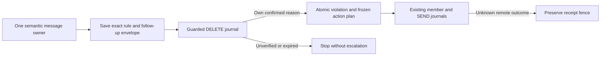

# Moderation fleet and Publisher reliability review

## Scope and evaluated implementation plan

The review starts at `46368d9f15801a249a743535dfb45d5b467d338a`. Every moderation
persona uses the same rule/execution engine; registry state, permissions and route
proofs determine which bot executes. Publisher is a separate exact-token,
exact-binding owner and must never fall back to a moderation bot.

Existing semantic message authority, command order fences, SQL sanction windows,
route epochs, immutable readiness deadlines, unknown-send/member fences and
bounded routing caches remain mandatory. Diagnostic off/shadow modes do not
disable semantic execution authority. This work extends those protections at
the remaining action boundaries rather than restarting whole-engine processing.

| Confirmed gap                                                                                                       | Planned correction                                                                                                                                                                             | Complexity / risk | Acceptance evidence                                                                                                      |
| ------------------------------------------------------------------------------------------------------------------- | ---------------------------------------------------------------------------------------------------------------------------------------------------------------------------------------------- | ----------------- | ------------------------------------------------------------------------------------------------------------------------ |
| Rate/count, subscription, mute and spammer delete intents can outlive their settings, author access or immunity     | Independently authorize durable reasons with current policy, exact message and selected executor; unavailable evidence stops the attempt; unsupported retired invitation access fails closed   | High / medium     | Disabled rules, changed limits, subscribed/protected author, unmute/unblock, mixed reasons and peer retries              |
| Generic sanction follow-up can run after its deletion reason was rejected                                           | Gate sanction on its own current reason and valid effect evidence; never use another reason's authorization                                                                                    | High / medium     | Edit to acceptable content, policy/admin/immunity changes and independent violations                                     |
| A queued warning can outlive a caller-only callback or retain a demoted ingress bot                                 | Persist the exact reason/policy/source deadline in the existing action envelope and revalidate after queue and quota waits using the selected executor                                         | High / medium     | Real queued delivery, changed policy/author access/immunity, malformed proof, known receipt and unknown-send recovery    |
| Required-subscription and duplicate notices can outlive the lease checked before queue handoff                      | Persist each feature's original notice proof; use its current authority at the actual transport boundary and retain the original media anchor and deadline                                     | High / medium     | Changed subscription, disabled rule, duplicate reset/revocation, protected author, old unbound plans and unknown sends   |
| A background DELETE winner can hide its verified reason from an inline caller                                       | Recover the caller's exact successful reason receipt without re-running deletion or the whole moderation engine                                                                                | Medium / medium   | Worker wins before inline attempt, one strike/follow-up, unrelated reason cannot lend its successful receipt             |
| A later background DELETE can finish after the engine exits, permanently losing its violation and follow-up         | Persist a versioned follow-up before DELETE; make only its own confirmed reason ready, then claim the semantic violation and frozen remaining action plan through a dedicated durable executor | High / high       | Confirmation after inline wait, persisted continuation after interruption, competing workers, changed policy and unknown SEND/member effect |
| Duplicate or bot-account follow-up can borrow shared deletion success without its own reason proof                  | Require the exact source/subject/reason receipt; duplicate explanations reuse real lifecycle authority through an independent lazy provider token                                              | High / medium     | Length-only success cannot authorize a duplicate sanction; foreign, pending and unverified bot receipts reject           |
| Queue-unavailable SEND fallback skips journal creation and mistakes a fresh action for an ambiguous retry           | Use the existing immediate action journal before execution in both fallback paths                                                                                                              | Medium / low      | Fresh send succeeds once; concurrent copies, accepted receipts and unknown outcomes retain their fences                  |
| Night/manual close deletes have only initial checks                                                                 | Current close/session proof, exact author/message and immunity at final dispatch                                                                                                               | Medium / low      | Opened/reclosed chat, elapsed timed close, changed schedule, protected author                                            |
| Returning to the same night schedule can revive old pending work                                                    | Advance the shared chat-control order for enabled, schedule and timezone writes; preserve the independent rules boundary                                                                       | Medium / low      | Real API disable/enable, schedule/restore and timezone/restore; old source rejected, new source accepted                 |
| Bot-scoped production member-action identity can bypass another bot's unknown outcome                               | Shared member-operation identity and compatibility with retained execution evidence; serialize competing starts                                                                                | High / medium     | Production wrappers, different bots and independent ledger instances, unknown BAN/KICK, proven pre-dispatch rejection, confirmed unban   |
| Content edits rewrite a leased/sending publication envelope and its recovery key                                    | Atomic edit/claim exclusion and immutable delivery attribution; receipts recover before new work                                                                                               | High / medium     | Real SQL/queue races, same-content save, lost receipt, cancel and post-actions                                           |
| Video preparation lacks identity attestation and failed completion cannot resume                                    | Attest both phases, delay runtime blockers without consuming attempts, explicitly resume owned unexpired completion                                                                            | Medium / low      | Wrong/unavailable identity, pause, retained failed BullMQ job and one actor-owned asset                                  |
| VK source lease reuses process identity across attempts                                                             | Unique attempt lease with expiry and transactional effect fences                                                                                                                               | Medium / medium   | Old attempt resumes after lease replacement; no stale import or lease completion                                         |
| Auto-reply loses a known send receipt after a transient SQL failure or slow dispatch                                | Retry database-only settlement against the exact immutable dispatch fence, including recovery-created AMBIGUOUS state                                                                          | Medium / low      | One remote send, known receipt retained, conflicting source/dispatch cannot settle                                       |
| Auto-reply policy or Publisher binding can change while its final transaction waits for a cooldown or delivery lock | Lock the exact owned delivery, then revalidate its rule, content, settings and unexpired Publisher binding before recording the immutable send fence                                           | Medium / medium   | Concurrent rule/content/module or binding changes commit while delivery waits; no stale remote send                      |

Additional scale correction: one unavailable recipient must not gate all other
pending recipients. Admit at most four candidates per pass, rotate blocked
recipients independently and preserve untouched attempt counts and final
per-recipient author authority. Complexity and risk are medium; acceptance uses
10,004 recipients with a stale/denied head, fresh tail, deadlines and cancellation.
Due filtering precedes route priority, so a permanently blocked target cannot
starve a recoverable route quarantine. The shared occurrence signal is cleared
through an indexed negative proof only after every pending/sending recipient
blocker is resolved, preserving explicit retry and missed-window evidence.

The final auto-reply review also found that a cooldown timestamp captured before
a lock wait can expire before the response starts. Evaluate conflict eligibility
with the database wall clock after the lock and anchor the admitted response's
cooldown to its immutable dispatch timestamp, without acquiring another blocking
lock after the final policy fence. Receipt-only settlement retains that timestamp
and never renews the cooldown or repeats the remote response.

The plan was checked against concurrency and rollback constraints before edits:
checks are repeated after quota/preparation waits; policy rejection may yield to
an independently valid reason but transport/storage uncertainty may not. An
accepted or unknown remote effect is never retried with new content, a new bot
or a new journal key. No long SQL transaction is held across MAX calls. Existing
rows require compatibility handling, not a blind identity/version reset.
Each verified reason retains its own expiry: a longer independent permit may
authorize the shared delete, but cannot lend its lifetime or receipt to an expired
mute, night closure, frequency decision or subscription binding. Policy hashes
use explicit semantic fields, excluding timestamps and unrelated UI/Publisher
settings; selected executor context is resolved again at the final sanction callback.
Preparation after a peer DELETE uses that proven DELETE bot. Queued notices carry
a versioned proof through the existing ledger and BullMQ envelope, while final
SEND and member callbacks use the actual selected executor. Receipt settlement
precedes policy revalidation; a policy change cannot erase an already known effect
or permit another remote send. Own-reason lookup uses two unique indexed probes
rather than scanning retained reason history.
Required-subscription notices precede deletion and therefore use their own source
proof instead of borrowing a generic post-delete proof. A recovered media plan
keeps its original anchor. Legacy unbound plans cannot authorize a fresh notice or
deletion; retained completed and unknown send journals still settle independently
without another remote attempt. Anti-duplicate explanations require their exact
policy, lifecycle and revocation authority rather than a fabricated sanction stage.
Queued notice qualification rechecks the selected route after fresh external
reads and before the feature's final policy/Redis permit; nothing awaits after
that permit. A definite policy revocation ends follow-up normally, while unknown
storage or transport results preserve the retry/ambiguity boundary.

New moderation notice envelopes carry a compatibility version independent of
their feature proof. Old unbound group notices cannot authorize a fresh SEND;
known receipts and unknown dispatches still settle before this check. This
conservatively suppresses old unverifiable greetings/night notices as well as
old rule warnings. The envelope version never substitutes for current rule,
required-subscription or duplicate authority.

The inline receipt observer is bounded and only handles a concurrently active
DELETE worker. It cannot provide crash recovery or authorize a later result.
Late continuation therefore requires a durable envelope created before the
original deletion, with exact reason/source/policy/deadline and semantic keys.
Historical background deletes without that envelope retain their conservative
no-escalation behavior. Continuation executes only remaining effects and must
never re-enter the whole rule engine or retry an unknown remote action.

## Remaining action-boundary review

Native acceptance found a gap when the administrator loses access before the
five-minute proof expires and no membership webhook arrives. A final MAX read
returns an access rejection, but the old guard path retained a retry without
refreshing the selected bot. The correction probes that bot's own membership and
switches only after confirmed loss of the needed capability. It retains the
original intent, lease, reason proofs and deadline; the new executor repeats every
final rule check. Missing permission fields and unavailable probes remain unknown
and cannot authorize a switch. An engine that already started keeps its historical
owner; only its remaining action transfers. Complexity is medium and risk is medium,
with native regressions for independently stale route caches, fresh/expired proof,
late mirrors, exact own-member uncertainty and restoration before/after expiry.

Action-only recovery also needs fair bounded reserve probing: four unavailable
candidates must not prevent later candidates from being checked on a subsequent
pass. The four-probe budget remains, while current negative proofs yield to unseen
or stale candidates. This is separate from the canonical owner readiness scan.

Index recovery remains one fixed reviewed command. Before repair or resolution,
it now checks successful-parent and unresolved/resolved step counts, freezes the
original failure family, and attests permanent default storage for the table,
database and indexes. Nondefault index options and tablespaces reject admission;
the disposable backend explicitly clears default and temporary tablespace choices.
These checks prevent an apparently matching index from writing to an unmonitored
device. They do not replace live capacity and queue-pressure supervision.

## Combined-release dependencies found in final review

The newly introduced manual unban attempt discarded the final route callback.
Its fresh target read and final Redis lease renewal could therefore finish after
the selected bot's SQL proof changed. Revalidate the selected route after both
waits, retain the sanction and lease checks, and keep no feature await after that
route check. The focused regressions block each wait separately and revoke the
route while it is blocked. This is a medium-risk integration correction; it does
not make independent SQL/Redis authorities atomic or confirm that MAX supports
unbanning. An attempted unban must retain its separate unknown-outcome fence and
must never clear BAN state or create a confirmed unban event.

The combined source floor also explicitly requires TRY_UNBAN_MEMBER's
irreversible start fence, watchdog quarantine and final unban route guard.
Once migration 10300 is applied, the existing schema gates already reject a
plain rollback to the earlier f25 source in both wrappers. The added source
checks are independent protection against a schema-compatible executor that
loses those readers/guards; source-only acceptance of f25 did not establish an
otherwise permitted production rollback. Isolated fixtures remove each classifier,
query, quarantine or final-route protection and must reject that target.
A separate local source test confirmed that the old gate accepts 7b1755f8,
which has the same migrations as corrected 9d440787 but lacks the final unban
route check. The strengthened gate rejects 7b and accepts 9d. This demonstrates
a schema-compatible unsafe source downgrade; other production rollback admission
conditions and live state were not exercised by that source test.

Independent read-only review also confirmed a release-blocking text-normalizer
gap: `(MB): 100` and `(Mb): 100` lose unit case before the number. The shared
normalizer affects source digests as well as duplicate fingerprints, so such an
edit can leave old deletion evidence apparently current. The parallel duplicate
review owns its correction. Before the combined runtime release, require its exact
green commit, text evidence-version advance and both rollback floors. Cover
numeric unit labels with brackets, separators, compound units, Cyrillic and format
characters; preserve ordinary prose and identifier case behavior. IMAGE identity
is separate. Source review establishes the defect, not successful correction or
production activation.

## Implementation and validation order

1. Implement independent moderation guards and sanction/member execution fences.
2. Implement publication editing/recovery isolation and video preparation recovery.
3. Fence VK attempt ownership, heartbeat, imports and terminal writes; settle known
   auto-reply receipts without another send.
4. Review the combined diff, run focused regressions, then public impact checks
   using disposable PostgreSQL 16, Redis 7 and BullMQ. Record actual coverage and
   skips; mock runs do not count as store/crash acceptance.
5. Submit the owned worktree; require Required and CodeQL on exact head/main SHA.
   Deploy every shared API role through the guarded wrapper, with migrations and
   compatible rollback floors. Never mutate production stores with ad hoc SQL.

## Scale and rollout acceptance

Use 1/4/9 receiving bots, plus 3/6/12, with one/all/limited administrators and a
replacement anywhere in the registry. Exercise absent rights webhooks, stale
role caches, concurrent mirrors, edits, delayed commands, recovery and deadlines.
Test catalog sizes 10,000/12,000/30,000 with uniform/hot/cold/media profiles.

Short synthetic catalog runs establish regression evidence only. Sustained
throughput, native IMAGE/OCR capacity, OS process kills, live MAX verification
and four 24-hour rollout cohorts require separately recorded results. Do not
claim a supported production throughput from a short simulated transport run.

Publication recipient admission changes to a bounded four-candidate pass with
independent blockers, fresh final authority and fair retry rotation. This bounds
access-probe fanout, not the existing delivery materialization/rollup reads, which
still scale with recipient count. Measure those reads before replacing them with
indexed keyset pages and incremental aggregates; a SQL LIMIT alone cannot certify
bounded work. Resource expansion follows measured limits and explicit authorization
for cost changes.

The shared member fence adds one concurrent partial index on the existing MAX
journal. Its predicate retains in-progress/ambiguous BAN/KICK and successful BAN
until confirmed unban; no history reset or new outbox is needed. The exact tuple
start lock ends before remote work. MAX API participant restoration is retired;
the unban regression models externally confirmed restoration through the existing
receipt-clear boundary, not a new unsupported MAX call.
An additional concurrent partial index covers unresolved Publisher recipient
blockers by occurrence. Both migrations are additive, have bounded lock/statement
timeouts and intentionally omit `IF NOT EXISTS`; failed concurrent-index receipts
must be reviewed rather than silently accepting an invalid retained index.

Ordinary message-limit and stop-list continuation uses a separate new empty SQL
outbox. It receives no historical authority backfill. Its original DELETE reason,
source time, five-minute maximum deadline and shorter reason deadline stay fixed.
Violation admission and the action plan commit together; the sanction event and
effect checkpoint also commit together. Unknown effects pin their parent evidence
and can enter only exact receipt reconciliation. Due searches use a database-clock
snapshot as an index bound; action claims and final fences use fresh wall time
after locks. Runtime shutdown stops admission and drains owned attempts before
closing stores. Commercial permits retain their original in-memory identity and
expiry, so they cannot be attached to this durable recovery path.
Receipt-only settlement makes no MAX profile reads and cannot renew global
spammer reputation. The final ownership fence runs after the last awaited policy
read, followed by a synchronous deadline check, so a blocked settings query
cannot let a replaced lease owner start a BAN.

The implementation also checks the final route from inside each feature permit,
rejects mixed feature authorities on a single SEND and preserves the production
action-key format through golden fixtures. Automatic immediate switching is
limited to a genuine local rejection before dispatch with the same journal,
callback and deadline. Exact Publisher bindings and pinned routes keep their
existing ownership boundary.

The earlier release encountered the guarded VPS migration-capacity preflight.
Reassess admission against the current infrastructure code at release time;
historical free-space measurements do not prove the current result. This session
retains the explicitly required 20 GiB shared-build reserve through the connector's
caller-supplied floor. Do not bypass data/temp/WAL/Docker floors or perform
host-wide garbage collection. A code implementation and green CI do not mean
the new runtime is active. Live tests use only the repository-designated test
chat/channel and agent-created content; no participant sanctions or diagnostic
messages in user groups.

## Recorded validation

The final unban-boundary integration staged run on 2026-10-05 passed all
783 API suites and 18,127 API tests without skips, all 50 native storage/queue
cases, API typecheck/build, and 1,080 static checks. Only two nested store-wrapper
lifecycle self-tests were skipped. The focused sanction suite passed 54 tests,
including route loss during the final target read and the final Redis renewal.
These are local/native-store results with simulated MAX, not production activation.

The access-loss follow-up staged run on 2026-10-05 passed 782 API suites and
18,102 tests, 50 storage/queue tests, API typecheck/build, all 959 infrastructure
checks, and 1,079 of 1,081 static checks. The two static skips are nested
store-wrapper lifecycle self-tests. The full API run skipped one executable-gated
Redis parity test; a separate public targeted run with the local Redis executable
passed that test. All 19 new full-path access cases, 373 delete-intent service
checks and 40 focused native recovery cases passed.

Independent review corrected two coverage descriptions: member-effect races use
independent ledger instances in one OS process; follow-up interruption recovery
uses persisted SQL state with the same service instance. Those cases do not
establish a service/OS restart, two-process execution, or SIGKILL recovery between
a remote effect and its receipt commit. The access-loss fixtures likewise use
two independent route caches in one OS process, not two API processes.

The follow-up native access fixtures cover absent permission webhooks with fresh
and expired proofs, two independent stale route-cache instances, recovery before
and after the saved deadline for 1/4/9 bots, restored former owners and late mirrors.
The action-only fixture reaches the ninth reserve through at most four probes per
pass while retaining one DELETE intent, its original deadline and one violation,
without replaying the engine. Unavailable own-member lookups and omitted permission
fields cannot authorize an immediate switch. These use real PostgreSQL 16, Redis 7
and BullMQ with simulated MAX transport. Accelerated deadlines and proof expiry
are explicit fixture inputs, not a five-minute or production soak result.

All 40 focused recovery checks passed with native stores and no skipped cases,
including actual cancelled concurrent-index repair, default-storage attestation
and the disposable PostgreSQL client's effective memory/temp/tablespace settings.

On 2026-10-05 the focused native continuation suite passed all 16 cases, including
persisted continuation after interruption, late DELETE, exact unknown-BAN reconciliation, cleanup pinning and lease
replacement during the last settings read. The queued duplicate suite passed
12 cases with real PostgreSQL, Redis and BullMQ. Final typecheck, source-generation
preflight, migration policy, whitespace and 196 selected rollback/deploy guard
checks passed before broad staged verification.

The final merged-head staged native verification of
`1359b31f05e076f49fca6f0d8233f20f2fe18148` passed 781 API suites and all 18,067
API tests, plus 50 retention/delete-lease storage tests, Prisma validation and build.
Repository static checks passed 1,007 tests with two explicitly skipped nested
test-store wrapper lifecycle self-tests; infrastructure passed all 887 tests.
The API/store coverage itself had no skipped tests.

The focused auto-reply follow-up run passed all 42 tests across two suites with
disposable PostgreSQL and Redis. It covers policy/content and binding changes
behind cooldown/delivery locks, last-read supersession, expired/future access,
unchanged proof renewal, immutable receipt settlement and the dispatch-anchored
cooldown. Successful hosted Required and CodeQL checks on the exact selected
release commit, synchronized VPS HEAD equality, guarded migrations/deployment and
strict smokes remain release gates. These local results do not establish production
activation.

The final finite catalog run passed all 12 combinations of 10,000/12,000/30,000
chats and uniform/hot/cold/media profiles with nine receiving bots. Each profile
submitted 20 logical messages at one message/second under the existing quotas:
240 logical messages produced 2,160 receipts, 240 violations and exactly 240
remote DELETE effects. Every profile drained to zero pending receipts/actions.
Per-profile completion p95 was 146–280 ms and ingress p95 was 12–54 ms on this
local host. These are sampled scenario timings, not a measured throughput ceiling;
transport and media were simulated, and one healthy primary executed each fixture.
The fixture used one physical webhook queue and one physical delete queue, each
with concurrency four. Its media profile covers attachment ingress and text/length
rules, excluding native IMAGE/OCR.
Native IMAGE/OCR capacity, prolonged load, production rollout cohorts and production
activation remain separate acceptance evidence.

The extended finite local run passed all four profiles at 30,000 chats with nine
receiving bots. Each profile submitted 600 logical messages at two/second over
five minutes, producing 5,400 receipts and exactly 600 violations, successful
delete intents and distinct remote DELETE effects. Across the run, 2,400 logical
messages produced 21,600 receipts and exactly 2,400 DELETE effects. All four
profiles finished with zero pending receipts/actions under the existing quotas.

| Profile | Ingress p95 | Receipt completion p95 | Final drain | Sampled peak pending receipts |
| ------- | ----------- | ---------------------- | ----------- | ----------------------------- |
| Uniform | 32 ms       | 312 ms                 | 103 ms      | 32                            |
| Hot     | 23 ms       | 241 ms                 | 115 ms      | 9                             |
| Cold    | 21 ms       | 460 ms                 | 232 ms      | 17                            |
| Media   | 116 ms      | 8,808 ms               | 7,716 ms    | 240                           |

The media profile's sampled oldest pending receipt reached 22,504 ms; pending
work was sampled every ten logical messages and drain peaks were excluded.
Its completion p95 and final drain differ materially from the other profiles.
Including final drain, its observed logical rate was 1.95/second against the
requested two/second. This latency/backlog tradeoff calls for separate media
profiling and capacity tuning before a production throughput commitment.
This run used the same local simulated transport, single-primary executor and
one-queue-per-type fixture above; the media profile still covers attachment
ingress and text/length rules only. These finite measurements establish admission,
effect uniqueness and final drainage for these scenarios, without certifying
production throughput, native IMAGE/OCR capacity or 24-hour rollout acceptance.
