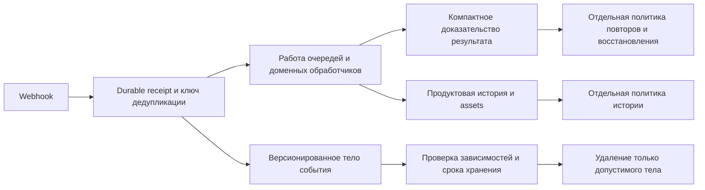

# План управляемого хранения и оптимизации диска MAXIM

Дата: 29 сентября 2026. Статус: проект для последовательной реализации.
Основание: [аудит VPS от 28 сентября](vps-storage-audit-2026-09-28.md) и текущие
Prisma schema, обработчики webhook, правила релизов и диагностика capacity.
Новые измерения production при подготовке этого плана не выполнялись.

Цель — вернуть устойчивый запас диска и сделать объём данных предсказуемым,
сохранив сообщения, публикации, историю санкций и защиту от повторных действий.
Основной путь: измерение → сокращение новых записей → безопасное завершение
жизненного цикла старых данных → физическое освобождение места → автоматический
контроль. Секционирование вводится только после разделения данных по назначению.

Это план, а не включение очистки. Предложенные сроки, лимиты, режимы и новые
модули ниже ещё не существуют в production, если явно не указано обратное.

## 1. Исходные факты и критерии результата

| Показатель из аудита         |                           Значение | Практический вывод                                                     |
| ---------------------------- | ---------------------------------: | ---------------------------------------------------------------------- |
| Основной диск                |          290 ГиБ, свободно 6,5 ГиБ | До любых записывающих работ пересчитать доступный резерв               |
| Том PostgreSQL               |                          241,6 ГиБ | Основной объект оптимизации                                            |
| Webhook + execution claims   |                         131,86 ГиБ | Самая большая группа для пересмотра жизненного цикла                   |
| Индексы public-таблиц        |                         100,17 ГиБ | Уже входят в размеры таблиц; нужен отдельный анализ назначения         |
| Audit log                    | 19,63 ГиБ, включая 19,10 ГиБ TOAST | Проверять крупные payload и продуктовые сущности внутри журнала        |
| Ленты модерации и участников |                          15,19 ГиБ | У исходных событий и производных историй разный жизненный цикл         |
| Media assets публикаций      |                           6,09 ГиБ | Сохранять материалы активных, запланированных и опубликованных записей |
| Cold-диск                    |                 207,7 ГиБ свободно | Полная копия существующего тома PostgreSQL туда не помещается          |
| Старые MAXIM images, preview |                     Около 2,65 ГиБ | Временный запас, не решение роста БД                                   |

Нельзя обещать освобождение всех 131,86 ГиБ событий: ещё не измерены возраст,
обязательные связи, полезный объём и физическая плотность файлов. TOAST и
индексы не прибавляются повторно к итогам таблиц. Из 324 секунд наблюдения
нельзя получить надёжный суточный прогноз.

Предлагаемые критерии завершения программы:

- На основном диске не менее **40 ГиБ свободно** после очередного релиза и
  нормального цикла RDB/backup; этот уровень согласован с существующим alert.
- Есть минимум семь полных суток наблюдения, включая рабочий пик и релиз;
  прогноз до исчерпания эксплуатационного резерва превышает 30 дней либо рост
  выбранных событийных данных вышел на устойчивое плато.
- У каждой растущей таблицы определены владелец, назначение, срок/условие
  хранения, исключения и способ измерения. Бессрочная история — явная политика.
- Уменьшение записываемых байтов на событие доказано на сопоставимом наборе
  типов событий; нет новых повторных отправок, потерянных receipts и нарушений
  прав. Существующие неразрешённые доставки остаются видимыми.
- API/очереди сохраняют принятые SLO. Для сравнения измеряется настоящая
  latency запросов/операций; oldest queue lag не выдаётся за latency.
- Проверено восстановление выбранной резервной копии; утверждены измеренные
  RPO/RTO. Наличие `.age`/checksum/ACK само по себе не доказывает восстановимость.

## 2. Архитектура хранения

Данные разделяются на четыре класса с независимыми правилами.

| Класс                          | Что содержит                                                     | Правило                                                      |
| ------------------------------ | ---------------------------------------------------------------- | ------------------------------------------------------------ |
| Незавершённая работа           | Receipts, leases, quarantines, запланированные действия          | Нельзя удалять по возрасту без доказательства завершения     |
| Компактные доказательства      | Дедупликация, результат исполнения, факт попытки, владение ботом | Живут не меньше окна допустимых повторов и восстановления    |
| Продуктовая история            | Предложения, публикации, комментарии, санкции, media links       | Срок определяется поведением продукта и зависимостями        |
| Тяжёлые диагностические данные | Полное исходное тело, повторные снимки, подробный debug          | Ограниченный срок/объём после обслуживания всех потребителей |

Это не обязательное немедленное создание четырёх новых таблиц. Сначала нужны
контракты жизненного цикла и совместимые читатели. Начальная реализация может
сохранить существующие таблицы; физическое разделение вводится после измерения
его пользы и доступного места.

Не добавлять Kafka, отдельную аналитическую БД или новый постоянно работающий
кластер ради этой задачи. PostgreSQL 16, существующие фасады, контролируемый
maintenance runner и имеющиеся метрики достаточны для первых этапов. CDN,
Object Storage и app2 не входят в архитектуру этого плана.

## 3. Этап A — запас места и измеримость

**Результат:** проверенный бюджет для следующей операции и воспроизводимая
картина хранения. Оценка инженерной работы: 1–2 дня; наблюдение продолжается
в следующих этапах.

1. Доставить отдельным изменением уже подготовленный `postgres-audit storage`
   и его тесты. Сейчас диагностические изменения находятся в локальном рабочем
   дереве; их наличие не означает постоянную установку на VPS.
2. Снять новый filesystem/Docker/release inventory. Повторить manifest-aware
   preview; удалять только его актуальные кандидаты в отдельной операции.
   Семидневный default сохраняется; 24 часа — отдельный выбранный cutoff,
   не новая безусловная настройка. Сохранить минимум пять релизов и все образы,
   защищённые манифестами либо любым контейнером.
3. Проверить существующие бэкапы, последнюю проверку восстановления и доступный
   disposable storage. Дамп с sole primary не запускать автоматически при
   нехватке места или без контроля очередей/I/O.
4. Добавить фиксированные каталожные диагностики возрастных границ и размера
   payload. Сначала plain EXPLAIN, затем ограниченные индексированные выборки.
   Никаких произвольных SQL-аргументов, полного COUNT или JSON GROUP BY на primary.
5. Снимать лёгкую capacity-телеметрию штатным механизмом с его cadence 15–60 с;
   полный storage inventory — первоначально раз в час, без перекрытия запусков
   и только при нормальной нагрузке. Для любого таймера сначала провести
   несколько ручных успешных запусков; сам план таймер не устанавливает.

Расширение каталога должно возвращать только фиксированные агрегаты:
размеры, возрастные границы, интервалы timestamps, число просмотренных строк,
truncation, размеры отдельных значений без содержимого. Выборки по статусам,
ботам и периодам обязаны сообщать смещение выборки; первые N старых строк не
являются случайной оценкой всей таблицы. Проверять план каждого SELECT и
доступность нужного индекса. Новые grants — только под конкретный отчёт с
существующей проверкой audit-role; не давать `pg_read_all_data`.

Метрики для сравнения: GiB по таблицам/индексам/TOAST, INSERT/UPDATE/DELETE deltas,
WAL bytes/s, RDB size, I/O latency/utilization, temp bytes, dead-row estimates,
длительность пачек, число пропущенных зависимостей и число retries. Для нового
формата метрик нужен versioned allowlist; не помещать table/row IDs, payload,
токены или произвольный SQL в существующий capacity archive.

**Решение о мощности принимается здесь.** Если нужный резерв не получается из
доказанно ненужных объектов, нельзя обещать работу без дополнительного места.
Тогда готовится отдельный вариант временного диска/проверенного внешнего
хоста с оценкой стоимости и времени. Он требует отдельного решения владельца;
базовый план сам не увеличивает платежи и не удаляет бэкапы ради рабочей БД.

## 4. Этап B — меньше данных при новых записях

**Результат:** уменьшается стоимость новых событий без переписи всей БД.
Оценка: 3–5 рабочих дней после матрицы потребителей.

### Версионированный payload

Составить матрицу `поле → потребитель → стадия → необходимый срок`: модерация,
callbacks, markup/mentions, антидубли текста/изображений, пересылки Publisher,
media packages, display names, participant reports, repair и восстановление.
Сейчас parser сохраняет `raw: payload`, а `persistReceipt()` сохраняет весь
update; `RAW_PAYLOAD_SAMPLE_RATE=0.01` ограничивает только отдельную raw-колонку.

Ввести внутренний формат payload с явной версией и компактным набором полей.
Сначала один reader понимает старую и новую версии и возвращает одинаковую
доменную модель. Затем включается writer. Не убирать `update.raw` у действующих
потребителей без замены: изображения, пересылки и markup могут отсутствовать
в остальных нормализованных полях.

Процедура: fixture/parity → shadow-сравнение на ограниченной выборке в памяти →
новый формат для ограниченной группы → 5% → 25% → 100%. Лестница здесь задаёт
предлагаемую стратегию, а не уже существующие флаги. Полные двойные копии в БД
не включать для всего трафика; ошибки сравнения хранить как коды и счётчики.
Сначала сохранять полный payload для типов с неподтверждённой эквивалентностью.

Можно отдельно проверить штатную TOAST LZ4-компрессию PostgreSQL 16, если она
доступна в конкретной сборке: на копии данных сравнить CPU, задержку, WAL и
сжатие. Изменение compression policy не переписывает все старые значения;
массовый UPDATE ради сжатия не является первым шагом.

**Приёмка:** совместимость old/new readers; crash/retry/multi-bot parity;
уменьшение новых байтов на сопоставимый workload. Исходная цель эксперимента —
не менее 25% для подтверждённых классов payload; это цель, не прогноз всей БД.

### Крупные значения в audit log

Разделить технический аудит и используемые продуктом записи логически до TTL.
Major legacy suggestion path сохраняет `images` в JSON; Publisher уже использует
media rows. Новые записи перевести на существующий формат ссылок/метаданных,
сохранив старого reader до окончания миграции.

Переиспользовать `publication_assets`/suggestion media только там, где совпадают
их ownership и жизненный цикл. SHA-256 дедупликация уже есть в пределах автора;
не расширять её на чужие аккаунты и не переиспользовать MAX upload token между
ботами. Подписи, filename и порядок изображений могут принадлежать ссылке,
даже если физические bytes одинаковы.

Старые записи переносить маленькими пачками: создать/проверить asset → атомарно
обновить versioned reference с CAS → проверить чтение → удалить только старую
копию после compatibility window. Не считать уменьшение base64 на 25% чистой
экономией диска: TOAST уже сжимает данные, результат измеряется на реальных
форматах. Перенос JSON в `bytea` в той же БД сам по себе не гарантирует большой
экономии и временно может увеличить объём.

## 5. Этап C — политика жизненного цикла событий и доказательств

**Результат:** компактное доказательство переживает удаление тяжёлого тела,
а старые данные имеют формально проверяемое условие окончания хранения.
Оценка: 4–6 рабочих дней; может потребоваться больше для сложных потребителей.

| Категория                                  | Начальное предложение                                                                  | Условие, запрещающее очистку                                                         |
| ------------------------------------------ | -------------------------------------------------------------------------------------- | ------------------------------------------------------------------------------------ |
| RECEIVED/QUEUED, активный lease/quarantine | Без возрастного удаления                                                               | Работа ещё возможна или исход неоднозначен                                           |
| Полное тело PROCESSED/DUPLICATE            | Кандидат: 7 суток после подтверждённого завершения, затем пересмотр по потребителям    | Нужен для history, import, reports, repair или незавершённой зависимости             |
| Terminal FAILED                            | Использовать текущие 24 часа только после проверки terminal/no-retry/quarantine правил | Возможен безопасный retry, detached operation или результат не установлен            |
| Dedupe/semantic execution proof            | До конца доказанного окна всех допустимых повторов и восстановления                    | Общая граница повторов не определена либо она бессрочна                              |
| Delivery/action ledger                     | Отдельная политика по типу действия                                                    | Attempted/UNKNOWN/ambiguous, активный сценарий, защита от повторной отправки         |
| Обычная модерация                          | Существующие 90 суток как исходная политика                                            | Запись нужна для санкций, жалоб или действующего решения                             |
| Санкции и отмены                           | Существующая специальная политика 365 дней                                             | Это последнее авторитетное состояние или его fence                                   |
| Предложения, публикации и их медиа         | Продуктовая политика и граф ссылок                                                     | Активное/запланированное содержание, действующая ссылка либо доказательство доставки |
| Feed/read models                           | Согласовать с продуктовой историей, отдельно от receipt                                | Нужны для dashboard, санкций или восстановления агрегатов                            |

Число семь дней здесь — кандидат для новых правил, а не команда включить
существующий cleaner. Текущий cleaner отсчитывает возраст от `created_at`,
каскадно удаляет claims и ещё не выполняет весь описанный dependency protocol.
На старом backlog это существенно отличается от срока после завершения.

Сначала определить `H = max(допустимый повтор MAX, retry/recovery очереди,
возраст разрешённого replay из restore, доменная история) + запас`. Нельзя
назначить всем tombstones 30 дней без доказанного H. Ограничение 24 часа у
Publisher `/start` не означает такое же ограничение у всех webhook.
Проверка давности edits использует время update/edit, не время создания
исходного сообщения. Исторические backfill/recovery имеют собственные правила.

Компактное доказательство содержит только необходимые versioned keys,
namespace/бота, окончательный результат и факт внешней попытки. Оно не обязано
сохранять весь JSON, но обязано оставаться авторитетным при отсутствии receipt.
Не использовать Redis TTL как единственную защиту от повторов. Отдельно
проверить смену владельца бота, зеркальные события и семантику UNBAN/re-BAN.

До первого удаления все точки приёма и повторного исполнения должны читать
новое доказательство: отсутствие старой строки не означает «событие новое».
Сохранить версию алгоритма semantic key и обеспечить lookup по совместимым
ключам. Читатели различают «тело удалено по политике», «результат неизвестен» и
«событие отсутствует»; ни одно из этих состояний не должно случайно разрешать
повторную отправку. Новый формат policy хранит версию, владельца, правило
eligibility, holds и минимальную совместимую версию runtime.

Протокол очистки одной единицы:

1. Получить кандидатов фиксированным индексированным keyset-запросом.
2. Проверить состояние, срок, reader/history holds, leases/quarantine и
   зависимые операции; число проверок и дочерних строк ограничить.
3. В одной короткой транзакции с CAS/блокировкой доказать terminal-состояние,
   сохранить необходимый независимый fence и удалить допустимое тело/ссылку.
4. При неизвестном состоянии пропустить кандидата с reason code; он не
   блокирует все последующие страницы и отдельно учитывается как hold.
5. Сохранить checkpoint только после COMMIT. Падение и повторный запуск не
   создают новые действия, не теряют строку и не снимают установленный fence.

Проверять каскады: 100 родительских receipts не означают 100 изменённых строк.
У candidate с превышенным child budget cleanup откладывается. Без атомарного
сохранения независимого proof нельзя включать каскадное удаление claims.

## 6. Этап D — ограниченное обслуживание с обратной связью

**Результат:** обслуживание уступает ресурсы пользовательскому трафику,
останавливается при ухудшении состояния и продолжает работу с checkpoint.
Оценка: 3–5 рабочих дней; сначала ручные короткие сессии.

Предлагаемый модуль — внутренний `storage-maintenance` с фиксированными
политиками и режимами preview/observe/apply. Это новый компонент кода, не
существующая команда. Первое внедрение — one-off runner на совместимом API
образе с минимальным доступом к БД, без MAX-токенов и без исходящих MAX calls.
Не переносить очистку в hot path `api-enqueue` и не нагружать роль
`api-message-retention`: она обслуживает удаление сообщений в MAX, другую задачу.

Один исполнитель на fleet, один DB connection, transaction advisory lock и
проверяемый fencing token для lease/checkpoint. Одного Redis lease без проверки
устаревшего исполнителя недостаточно. На VPS runner уважает существующий
deploy/backup lock; держит его на короткую ограниченную сессию, освобождает перед
ожиданием. Не выполнять cleanup одновременно с deploy, preload, restore,
тяжёлым backup или другой индексной операцией. Не обходить занятый lock.

Preview создаёт ограниченный по сроку план с source SHA, версией policy,
cutoff, классом данных и бюджетом. Apply проверяет их повторно, а eligibility
каждой строки заново доказывается в транзакции. Устаревший preview не является
разрешением удалить изменившуюся строку. Журнал операции содержит версию,
checkpoint и агрегаты; тела сообщений в него не копируются.

Предлагаемые стартовые пределы, подлежащие проверке на staging:

| Предел                      | Начальное значение/правило                                      |
| --------------------------- | --------------------------------------------------------------- |
| Concurrency                 | 1                                                               |
| Parent rows за транзакцию   | До 100; верхний предел после испытаний 500                      |
| Lock timeout                | 100–250 мс                                                      |
| Statement timeout мутации   | 1–2 с                                                           |
| Сессия runner               | До 60 с, затем освобождение ресурсов                            |
| Повтор после успешной пачки | Не чаще одного раза в 5 с в первой пробе                        |
| Initial apply               | До 1 000 родителей суммарно, плюс проверенный child/byte budget |
| Потолок throughput          | До исходных 500/30 с, пока не доказан больший безопасный бюджет |

Размер/частоту регулировать по времени транзакции, WAL, I/O и очередям, а не
только по числу удалённых строк. Cluster WAL включает полезную работу других
запросов: использовать его как консервативный предел, не приписывать всё cleaner.
Не повышать concurrency для ускорения исторического backlog.

| Сигнал                                                                                 | Предлагаемая реакция runner                                                                 |
| -------------------------------------------------------------------------------------- | ------------------------------------------------------------------------------------------- |
| Любой readiness failure, Redis persistence error, queue fence либо неизвестные метрики | Не начинать следующую пачку; штатно завершить текущую ограниченную транзакцию               |
| Queue lag >10 с устойчиво 30 с или >30 с в одном образце                               | Пауза; существующие продуктовые thresholds не менять                                        |
| I/O utilization >80% или iowait >15% устойчиво                                         | Снизить бюджет; при критических штатных порогах остановиться                                |
| WAL/temp/длительность превысили бюджет или появились повторные lock timeout            | Остановка и пересмотр плана                                                                 |
| Свободное место меньше рассчитанного резерва операции                                  | Остановка до следующего изменения ресурсов/плана                                            |
| Здоровое окно после паузы                                                              | В первой фазе ручное возобновление; позднее не менее 10 минут стабильности и меньший бюджет |

Автоматика не увеличивает срок token/прав, не отключает Redis write protection,
не выбрасывает принятые webhook и не отвечает успешным приёмом до durable receipt.
Настройки `MESSAGE_RETENTION_MODE` и функции модерации не меняются.

## 7. Этап E — индексы и лишние UPDATE

**Результат:** меньше стоимости записи и дублирования, доказанная польза каждого
крупного индекса. Оценка: 3–5 дней анализа/реализации плюс окно наблюдения.

Для крупнейших индексов создать паспорт: query owner, тип уникальности,
предикат/порядок ключей, размеры, usage delta, rare/disabled feature,
план запроса на representative data. Сравнивать минимум семь полных суток;
для редких операций дополнить период тестами/планами, не ждать ложного вывода
«0 scans = не нужен». Проверять reset статистики.

`webhook_events_report_history_idx` размером 3,91 ГиБ — первый объект ревью,
но не готовый кандидат на DROP. Если индекс нужен выключенной функции,
сначала определить, как её включение проверит/создаст индекс и сколько это
потребует места. Уникальные dedup/semantic keys и source-floor guards остаются.

Уменьшение индексов: убрать доказанно избыточные; сократить ключи только после
проверки semantics; заменить общий индекс частичным по действительному набору
запросов; ограничить число индексов у новых payload-таблиц. Учитывать, что
partial predicate обязан совпадать с production query, включая literal statuses.
PostgreSQL не имеет штатного invisible-index режима: эффект удаления проверять
на восстановленной копии/стенде, не отключением индексных сканов на primary.

Проверить высокую частоту UPDATE у `moderation_delete_intents` и `vk_parsing_posts`:
на 324-секундном образце были 16 874 и 20 173 обновления. Выделить meaningful
state changes, lease renewals и polling/no-op writes. Использовать conditional
UPDATE/CAS, более редкие checkpoint-записи и раздельное хранение часто меняющегося
служебного состояния, только если это снижает суммарный I/O. Нельзя убирать
renewal/updated_at, от которого зависят leases, recovery или конкурентный доступ.
Проверить HOT-update долю и цену каждого индекса на изменяемом поле.

## 8. Этап F — физическое освобождение места

**Результат:** вырос `df available`, а не только счётчик удалённых строк.
Операционное время определяется после измерения плотности и объёма кандидатов.

Разделять три величины: логически завершённые данные, место для повторного
использования внутри PostgreSQL и байты, реально возвращённые файловой системе.
Обычный VACUUM полезен для повторного использования; shrink файла не гарантирован.
Autovacuum уже работает — не отключать его для эксперимента.

Для каждой записывающей операции рассчитывать по отдельным mount points:

`F_before >= F_service + S_copy + S_temp + S_WAL_peak + S_rollback + margin`.

`F_service` покрывает обычный рост за окно реакции, очередной полный Redis RDB
с временным файлом и нужный эксплуатационный запас. `S_copy` включает таблицу,
TOAST и индексы конкретного инструмента; `S_WAL_peak` — пиковое удержание WAL,
не все когда-либо сгенерированные байты. `S_rollback` — реально сохраняемая
старая копия/артефакты. Не учитывать ожидаемую экономию как уже свободное место.
Все члены проверять на стенде, резерв margin первоначально не меньше 30%
измеренной дополнительной потребности. Не подменять этим build floors 20/6 ГиБ.

| Способ                                | Когда применять                                           | Основное ограничение                                                                |
| ------------------------------------- | --------------------------------------------------------- | ----------------------------------------------------------------------------------- |
| DROP доказанно ненужного индекса      | Его отсутствие проверено для всех потребителей            | Заранее оценить rebuild при откате; короткие DDL locks и отдельная миграция         |
| Обычный VACUUM                        | После небольших batch cleanup по здоровой БД              | Обычно не даёт существенного возврата места ОС                                      |
| REINDEX CONCURRENTLY                  | Доказанное раздувание конкретного индекса                 | Старый и новый индекс сосуществуют; возможны invalid artifacts, нужен план recovery |
| pg_repack/аналогичная онлайн-перепись | Инструмент проверен для PG16, схема и нагрузки совместимы | Дополнительная копия, change log, привилегии/extension, brief locks и WAL           |
| Restore/migrate в компактную БД       | Есть проверенная площадка/ёмкость и допустимое окно       | Полная процедура cutover, consistency и защита от повторных действий                |
| VACUUM FULL                           | Только отдельное окно с доказанным бюджетом               | Блокировки и дополнительная копия; не аварийный шаг на 98% диска                    |

Ни один инструмент не устанавливается «на всякий случай». Сначала малый объект,
снимок до/после, оценка запаса, проверка rollback; затем следующий. Не делать
первой операцией перепись `webhook_events` размером 112,8 ГиБ. Если без нового
места нужная перепись не помещается, этап явно блокируется ёмкостью; повторные
DELETE, перенос на cold-диск или уменьшение safety floor этого не исправляют.

## 9. Этап G — секционирование по времени, если оно окупается

**Результат:** следующий цикл старения данных освобождает целые физические
разделы предсказуемо. Оценка: ещё 1–2 недели после совместимых readers и модели
proof; это отдельное архитектурное решение, не обязательная зависимость первых
этапов. Сначала оценить более простую модель без partitioning.

Предпочтительный первый объект — новые append-only payload/history данные с
единым сроком хранения. Гранулярность daily/weekly выбрать по bytes/day и цене
DDL; не создавать сотни разделов без необходимости. Разделы создавать заранее,
контролировать отсутствие ожидаемого раздела и неожиданные записи в fallback.
План повторных reads должен знать и ключ, и временной bucket, иначе partition
pruning не получится и point lookup превратится в fanout.

У PostgreSQL 16 нет произвольного глобального UNIQUE над time partitions:
уникальный ключ partitioned-таблицы должен включать partition key. Поэтому
нельзя просто добавить `created_at` к текущим `id`/`dedup_key` и считать
дедупликацию прежней. `WebhookExecutionClaim` сейчас ссылается на receipt с
`ON DELETE CASCADE` — этот граф тоже требует совместимой миграции.

Возможная конструкция: небольшой непартиционированный identity/proof registry с
глобальными уникальными ключами + отдельные time-partitioned тела. Registry сам
имеет обоснованный жизненный цикл из этапа C; он не превращается в новый вечный
журнал. Нужны отдельные решения для late arrivals, updates и references между
bucket. Partition key нельзя менять при обычном обновлении статуса.

Внедрение: additive schema → readers обеих версий → атомарная запись identity
и нового тела → новые события на новом пути → bounded backfill только нужных
старых данных → переключение readers → compatibility window → отдельное
удаление старой структуры. Dual-write должен быть атомарным в одной БД, иначе
нужен проверенный outbox/reconcile. Идентичность источника и Prisma mappings
фиксируются; массовый backfill не должен дублировать 132 ГиБ без резерва.

Закрытый раздел удаляется только после проверки retention cutoff, отсутствия
активных зависимостей/holds, сохранения proof и завершения rollback window.
Если в разделе остался hold, сохранить раздел либо перенести строго этот hold
по проверенному протоколу — не удалять его вместе с остальными данными.
`DETACH` сам по себе не освобождает дисковое место; физический эффект наступает
после допустимого удаления detached relation. Заранее проверить lock/FK и
ограничения concurrent detach для выбранной схемы.

## 10. Проверки, canary и восстановление

Каждый runtime PR проходит impact planner, локальные checks и CI для точного SHA.
API/schema изменения выпускаются на все 14 API ролей общего образа и требуемый
OCR auxiliary с существующим queue fence; stateful контейнеры не пересоздаются.
При contracts changes проверяются все потребители. Не запускать проверки,
обходящие repo-locks генерации. Скрипты operational tooling проверяются отдельно
и не требуют фиктивного деплоя приложения.

Обязательные сценарии на настоящем disposable PostgreSQL 16:

- Повтор одинакового события/semantic key после удаления тела и после restore;
  concurrent mirror от второго бота, reorder и edit старого сообщения.
- Crash до proof, между proof/delete и после COMMIT до checkpoint; истечение
  lease и продолжение работы устаревшего runner.
- Cleanup одновременно с report/import/history read, publication attempt,
  созданием asset reference и сменой владельца состояния.
- Сохранение UNKNOWN/attempted delivery, quarantine и последнего sanction fence;
  невозможность повторного SEND/BAN только из-за исчезновения тяжёлой записи.
- Payload/media parity, связь с автором/ботом, независимые filenames/порядок,
  чтение старой версии в compatibility window.
- Query plans, cascades, locks, temp/WAL peaks и ограничение реальной работы
  batch даже на большой таблице; PGlite/unit tests не заменяют эти испытания.
- Disk/Redis failure, неполные метрики, deploy collision: runner прекращает
  новые пачки, webhooks и runtime protection не ослабляются.

Предлагаемая лестница destructive cleanup: preview → observe без записей →
до 1 000 кандидатов → проверка 24 часов/пиков → ограниченный дневной бюджет →
постепенное увеличение по ресурсному бюджету. Сначала только один класс данных.
Процент строк не заменяет лимит байтов, child fanout и времени. Не увеличивать
одновременно batch, rate и число классов: иначе эффект невозможно объяснить.

Откат приложения не восстанавливает удалённые данные. До удаления старых полей
выпустить readers, которым эти поля уже не нужны, и установить соответствующий
rollback source floor. Delete применим только к данным с истёкшей утверждённой
политикой либо с проверенной нужной копией. Остановка runner — быстрый откат
нагрузки; восстановление данных — отдельная процедура, не обычный image rollback.

Restore проводится в изоляции: исходящие действия/планировщики остановлены,
дедупликация и попытки после момента backup учитываются отдельным recovery
protocol. Нельзя включать старую БД вместе с устаревшими очередями и автоматически
переигрывать отправки. Если после backup были удалены proof или потерян журнал
внешних попыток, это отдельный блокер восстановления dispatch. После теста
удалить только собственную disposable копию, сохранив рабочие бэкапы.

## 11. Реализационный backlog и зависимости

Это порядок PR/операций, а не список одновременно запускаемых работ.
Ответственность указана по областям; конкретных людей/агентов план не назначает.

Инфраструктурная область отвечает за S0/S1/S9/S11; API и доменные владельцы —
за S2–S7; индексы, миграции и partitioning S8/S10 требуют совместной проверки
API и PostgreSQL. Изменения видимой истории дополнительно проверяются на
соответствующих сценариях mini app и Safety Desk.

| Шаг | Артефакт и основные места изменения                                                          | Зависимости                      | Приёмка                                                                |
| --- | -------------------------------------------------------------------------------------------- | -------------------------------- | ---------------------------------------------------------------------- |
| S0  | Diagnostic tooling: `infra/scripts/postgres-storage-audit.mjs`, wrappers, каталог наблюдений | Уже подготовленный локальный код | Тесты, EXPLAIN, ограниченный live report, source синхронизирован       |
| S1  | Capacity/restore worksheet и reviewed image reclaim                                          | S0                               | Свежие размеры, границы бюджета и проверка доступности восстановления  |
| S2  | Матрица readers, versioned lifecycle policy, replay/restore ADR                              | S0                               | Ни одного неопределённого destructive predicate                        |
| S3  | Payload reader/writer в webhook parser/service и доменных потребителях                       | S1 для rollout, S2               | Old/new parity, меньше новых bytes/event                               |
| S4  | Media metadata writer и совместимый legacy migration                                         | S1 для rollout, S2               | Атомарные ссылки, reader parity, нет потери ownership                  |
| S5  | Independent proof и dependency holds; additive Prisma migrations                             | S2; совместимость S3             | Crash/replay/restore tests и проверка каскадов                         |
| S6  | Новый внутренний maintenance runner, budget/lease/checkpoint, operational wrapper            | S1, S5                           | Preview, ограниченная работа, паузы, отсутствие MAX calls              |
| S7  | Read-model/ledger retention по утверждённым классам                                          | S2, S6                           | Корректные dashboard/history/санкции, UNKNOWN сохранены                |
| S8  | Index passports и no-op UPDATE/CAS fixes                                                     | S0, S2; для удаления S1          | Доказанное назначение/избыточность, correctness + нагрузочные проверки |
| S9  | Пообъектное физическое освобождение                                                          | S1, результаты S6–S8             | Проверенный budget/rollback, измеримый рост `df available`             |
| S10 | ADR и при необходимости time partitions                                                      | S3, S5, S9/достаточная ёмкость   | Уникальность, FK, pruning, безопасное старение разделов                |
| S11 | Регулярная observability, release-aware reclaim и maintenance schedule                       | Успешные ручные S6/S9            | Семь суток без регрессий, защита от перекрытия и прогноз ёмкости       |

Ориентир для одного последовательно работающего инженера: 3–4 недели до
проверенной компактной записи и ограниченного lifecycle cleanup; 6–8 недель
до полного эксплуатационного цикла, больше при сложном восстановлении или
миграции partitioning. Это оценка, не обещание срока освобождения N ГиБ.
Окна наблюдения, дополнительное место и согласование продуктовых сроков могут
стать критическим путём. Первые безопасные операции с образами возможны раньше.

## 12. Что считать успехом каждого направления

| Направление                 | Отчёт о результате                                                  | Недостаточное доказательство          |
| --------------------------- | ------------------------------------------------------------------- | ------------------------------------- |
| Docker reclaim              | Реальные свободные байты до/после и сохранённые release refs        | Сумма SIZE у удалённых tags           |
| Компактные новые записи     | Bytes/event по сравнимым типам и неизменные результаты обработчиков | Только меньший JSON в unit test       |
| Lifecycle cleanup           | Eligible/held/removed, ресурсы, отсутствие повторных действий       | Число DELETE без оценки каскадов      |
| Payload/media migration     | Ссылки и ownership проверены, реальный net storage delta            | Обещание 25% за счёт отказа от base64 |
| Index optimization          | Планы всех потребителей, latency/write cost, физические размеры     | Единственный снимок `idx_scan=0`      |
| Физическая перепись         | `df available`, размеры relation/index, запас после операции        | Снижение estimated live rows          |
| Долговременная устойчивость | Полные 7/30-дневные окна, прогноз и tested restore                  | Пять минут ровного графика            |

Прогноз должен учитывать отдельно непрерывный рост БД и скачки релизных образов,
backup/RDB/temp peaks и соседние приложения. При положительной скорости роста
`runway = (доступные байты − эксплуатационный резерв) / консервативный bytes/day`;
при недостаточных данных или неположительном знаменателе не показывать ложное
«бесконечно». Физическую экономию разных направлений нельзя складывать, если
они затрагивают одни и те же bytes webhook, индексов или TOAST.

Рекомендуемый старт: S0–S2 и подготовка S3/S4; первая destructive операция —
только актуальный reviewed image reclaim. Перепись базы, массовое включение
старого cleaner и новые платные ресурсы не следуют автоматически из этого плана.
